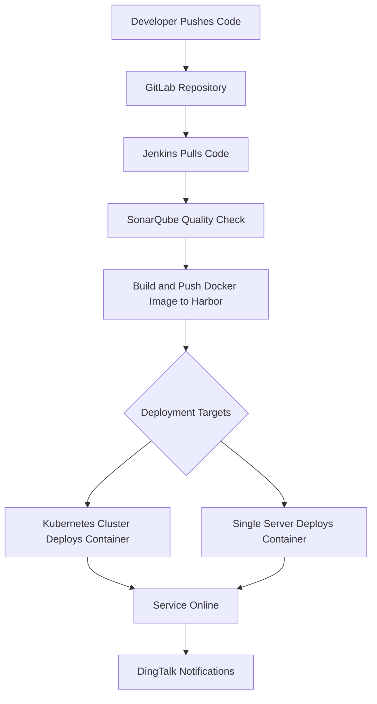

**DevOps CI/CD Pipeline with Jenkins, GitLab, SonarQube, Harbor, and Kubernetes**

This project demonstrates a complete **DevOps CI/CD pipeline** that automates the processes of **code integration, quality assurance, containerization, and deployment** using industry-leading tools. It provides a robust workflow to ensure high-quality, efficient, and reliable software delivery.


**🚀 Project Overview**

This project implements the following capabilities:

​	•	**Code Management**: Version control and branch management with **GitLab**.

​	•	**Continuous Integration**: Automated build and integration using **Jenkins**.

​	•	**Code Quality Analysis**: Static code analysis with **SonarQube** to ensure code health.

​	•	**Containerization**: Build and store **Docker images** in a private **Harbor** repository.

​	•	**Automated Deployment**: Deploy containers to servers or orchestrate with **Kubernetes**.

​	•	**Notification**: Integrate **DingTalk** bots for real-time CI/CD status notifications.

**🛠️ Technology Stack**

| **Tool/Technology**  | **Purpose**                            |
| -------------------- | -------------------------------------- |
| **GitLab**           | Version control and repository hosting |
| **Jenkins**          | CI/CD pipeline orchestration           |
| **SonarQube**        | Code quality and static analysis       |
| **Docker**           | Application containerization           |
| **Harbor**           | Private Docker image repository        |
| **Kubernetes (K8s)** | Container orchestration and deployment |
| **DingTalk Bot**     | Deployment result notifications        |


**📊 Project Workflow**

Below is the complete DevOps pipeline architecture:



**📂 Project Directory Structure**

```plaintext
DevOps-CI-CD-Pipeline/
├── README.md               # Project documentation
├── scripts/                # Jenkins pipeline and deployment scripts
│   ├── jenkins_pipeline.groovy
│   ├── deploy.sh           # Deployment script
│   ├── build_and_push.sh   # Image build and push script
├── docker/                 # Dockerfile for image creation
│   └── Dockerfile
├── k8s/                    # Kubernetes YAML configurations
│   ├── deployment.yaml
│   └── service.yaml
├── docs/                   # Supplementary documents and screenshots
├── resources/              # Flowcharts and architecture diagrams
│   └── devops_flowchart.png
└── test/                   # Example test cases
```


**📝 Features and Implementation**

**1️⃣ Code Management - GitLab**

​	•	Utilize **GitLab** for version control with branching and tagging.

​	•	Code pushes trigger **Jenkins pipelines** for CI/CD workflows.

**2️⃣ Continuous Integration and Quality Assurance**

​	•	**Jenkins** pulls code from GitLab and compiles it using **Maven**.

​	•	Perform static code analysis with **SonarQube** to maintain code quality.

​	•	**Example Jenkins Pipeline** for quality analysis:

```groovy
stage('SonarQube Analysis') {
    steps {
        sh '/var/jenkins_home/sonar-scanner/bin/sonar-scanner -Dsonar.projectKey=${JOB_NAME} -Dsonar.sources=./ -Dsonar.java.binaries=target/'
    }
}
```

**3️⃣ Docker Image Build and Push - Harbor**

​	•	Package applications into **Docker images** and push them to **Harbor**.

​	•	Automate with the following script:

```bash
docker build -t ${HARBOR_REGISTRY}/${PROJECT_NAME}:${DOCKER_IMAGE_TAG} .
docker push ${HARBOR_REGISTRY}/${PROJECT_NAME}:${DOCKER_IMAGE_TAG}
```

**4️⃣ Automated Deployment - Kubernetes**

​	•	Deploy containers using **Kubernetes** to achieve scalability and high availability.

​	•	Example **Kubernetes deployment YAML**:

```yaml
apiVersion: apps/v1
kind: Deployment
metadata:
  name: my-app
spec:
  replicas: 2
  selector:
    matchLabels:
      app: my-app
  template:
    metadata:
      labels:
        app: my-app
    spec:
      containers:
        - name: my-app
          image: harbor.local/my-repo/my-app:latest
          ports:
            - containerPort: 8080
```

**5️⃣ Notifications - DingTalk Bot**

​	•	Notify teams of deployment results via **DingTalk** real-time messages.

​	•	Example notification script:

```groovy
post {
    always {
        sh '''
        curl -X POST -H 'Content-Type: application/json' \
        -d '{"msgtype": "text", "text": {"content": "Project ${JOB_NAME} deployment completed successfully!"}}' \
        'https://oapi.dingtalk.com/robot/send?access_token=YOUR_TOKEN'
        '''
    }
}
```

**🔧 How to Run This Project**

​	1.	**Environment Setup**

​	•	Install Jenkins, GitLab, SonarQube, Docker, Harbor, and Kubernetes.

​	•	Configure network settings and servers as described in the scripts.

​	2.	**Execution Steps**

​	•	Clone the repository:

```bash
git clone https://github.com/Zhengtx-hub/DevOps-CI-CD-Pipeline.git
```

   •	Execute Jenkins pipeline jobs to trigger CI/CD workflows.

​	3.	**Verification**

​	•	Access **Kubernetes services** and validate application deployment.

​	•	Review **SonarQube reports** for code quality analysis.

​	•	Verify pushed Docker images in **Harbor**.


**🎯 Highlights**

​	•	**End-to-End Workflow**: Covers code push, quality checks, containerization, and automated deployment.

​	•	**Toolchain Integration**: Seamlessly integrates **GitLab, Jenkins, SonarQube, Docker, Harbor**, and **Kubernetes**.

​	•	**Automation**: Custom scripts and pipelines minimize manual intervention.

​	•	**Real-Time Notifications**: Alerts teams instantly via **DingTalk Bot**.

**📊 Results**

*screenshots of Jenkins jobs, SonarQube reports, Harbor registry, Kubernetes services, and DingTalk notifications will be here"


**📌 Future Enhancements**

​	1.	Implement **Blue-Green Deployment** or **Canary Releases** for zero-downtime updates.

​	2.	Integrate monitoring tools like **Prometheus** and **Grafana** for real-time system monitoring.

​	3.	Add security scanning for Docker images using tools like **Trivy** or **Clair**.


**💡 Conclusion**

This project demonstrates a complete and practical **DevOps CI/CD pipeline** using modern tools and technologies. It highlights efficient code integration, quality assurance, containerization, and automated deployment processes.

If you find this project valuable, please ⭐ **star** the repository!

For any questions or suggestions, feel free to open an **Issue**.


